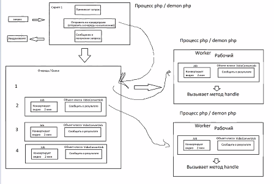

Laravel Jobs

PHP - в рамках одного скрипта - выполняется синхронно.
В рамках клиент-серверной архитектуры - в php cерверная часть м. работать асинхронно

PHP: цикл запроса
Web-client (nginx) 
-> php-интерпретатор: получает команду на выполнения скрипта -> 
                      для чего запускает php-process (demon) - один запрос = один процесс
                      (n запросов = n php-process, каждый php-process выполняет свой скрипт синхронно, 
                       в рамках всего сервера php-processes(или demons) выполняются асинхронно)

1_client = 1_process

Laravel Job (queue)
Джоба  а) задача, которая будет совершена на сервере (в фоне) без запроса пользователя.
       б) часть запроса, которая м.б. выполнена независимо от основного запроса. 
(результат не нужен в данный момент или не требуется совсем). 

Джобы должны имплементить Illuminate\Contracts\Queue\ShouldQueue и использовать трейт Illuminate\Foundation\Queue\Queueable;

/**
class *JobName*Job implements Illuminate\Contracts\Queue\ShouldQueue
{
use Queueable;
...
/*

Метод dispatch - добавляет в оччередь джобу 
->onQueue('queue_name') - определяет в какую очередь будет добавлена джоба
...Job::dispatch(...методы конструктора джобы...)

В метод handle(передаем зависимости)
Значения конструктора - параметрами метода dispatch

Порядок выполнения: FIFO

Worker - отдельный процесс php (demon). 
Для одной очереди м.б. несколько worker-ов, распределением занимается Laravel.

php artisan queue:work
php artisan make:job
php artisan queue:work --queue=high,low

Элементы:  
задача -> 
отправитель(dispatcher) -> 
очередь (физически в DB - переопределить поведение QUEUE_CONNECTION) 
-> воркер (worker) 

Джобы на сервере
Systemd (linux)  
supervisor (laravel doc)