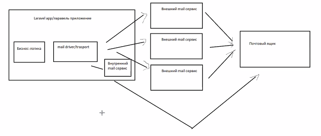

MAIL_MALLER - . env
config/mail.php (default)

mail driver или transport - реализует логику по отправлению email: 
результат - отправление email, как будет отправлено - зависит от выбранного транспорта
Транспорты, работающие с внешними серверами: app(transport (mail driver))-> внешний mail сервис -> почтовый ящик 
Внутренний mail сервис : app(transport (mail driver)-> внутренний mail сервис) -> почтовый ящик

Причины использования внешних сервисов:
Нагрузка на внутренний mail сервис
Гарантия доставки: почтовый сервис не доверяет настройкам внутреннего mail-сервиса

Минусы:
1. Не контролируем внешние сервисы
2. Платные

Email: Класс и Шаблон

php artisan make:mail TaskCompleteMail
... extends Mailable
{
use Queueable, SerializesModels;

метод envelope() - заголовок, subject, to
метод content() - содержание
метод attachments() - вложения

Отправка фасад Mail::to('')->send($email);

Передача данных: 
1. Через публичные свойства конструктора 
2. public function content(): Content
{
return new Content(
view: 'mail.tasks.complete',
with: [
'textUpp' => mb_strtoupper($this->text),
]
);
}
