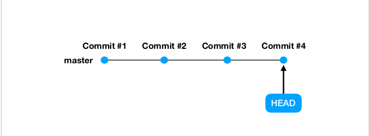
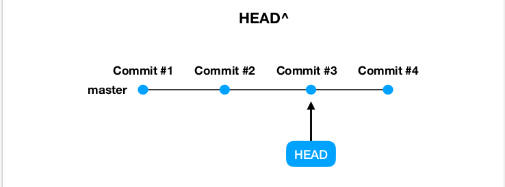
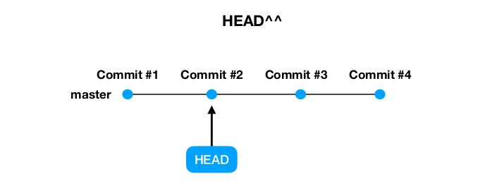
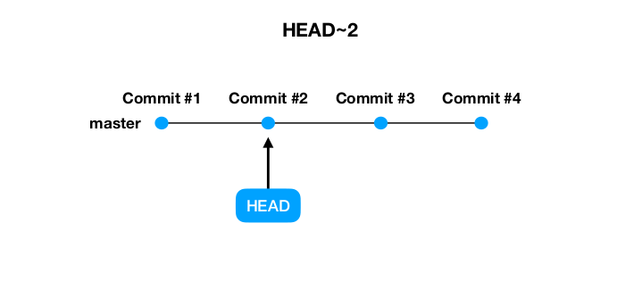
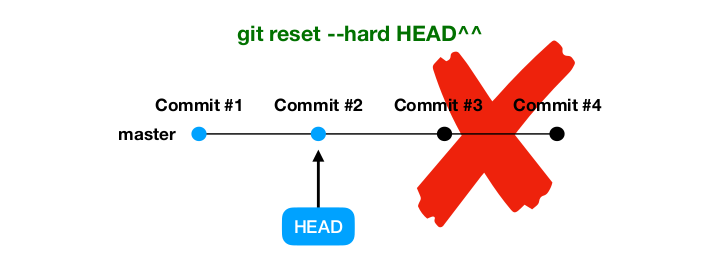
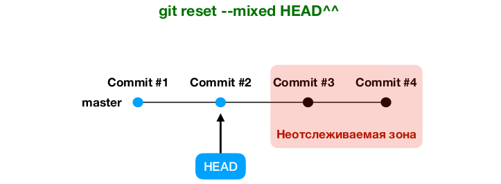
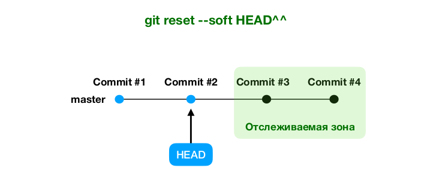
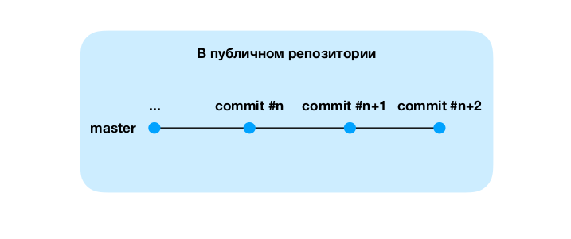
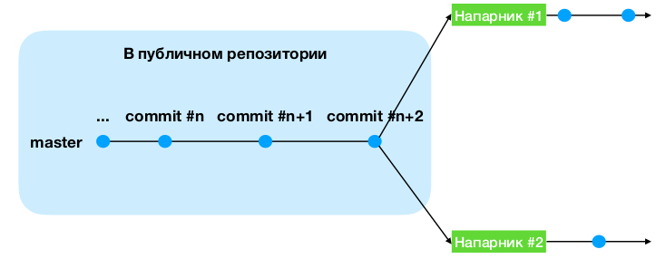
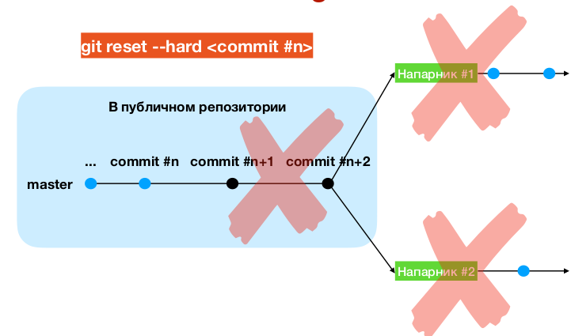

# git reset

Предназначена для отмены каких - либо
изменений в проекте, откату проекта к какому -
то снимку.

## Указатель HEAD

Обычно указывает на последний (текущий) коммит

##### HEAD можно смещать

---

---

## Имеет 3 режима
в зависимости от радикальности отката к указанному коммиту\
--soft\
--mixed\
--hard

## git reset (синтаксис вызова)

git reset [--soft | --mixed | --hard] [commit] <--- Может быть хэш коммита (уникальный идентификатор) или различные вариации с HEAD

### git reset --hard

Возвращает проект к указанному коммиту, при этом полностью удаляет все коммиты после указанного.

Самая "сильная" вариация git reset. Удаляет коммиты безвозвратно!

### git reset --mixed (по дефолту)

Возвращает проект к указанному коммиту, при этом переводит все коммиты после указанного в неотслеживаемую (unstaged) зону.

### git reset --soft
Возвращает проект к указанному коммиту, при этом переводит
все коммиты после указанного в отслеживаемую (staged) зону.

---
#### Можно и по хэшу коммита

git reset [--soft | --mixed | --hard] a0e33627548578d5b94c3b8f4f885303a2cd4eec

---

#### При вызове без указания желаемого коммита по-умолчанию используется HEAD.

git reset = git reset --mixed HEAD

---

### Опасность git reset

Никогда не делайте git reset <commit #n> после того, как вы опубликовали какие-либо коммиты после <commit #n>

