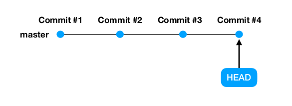
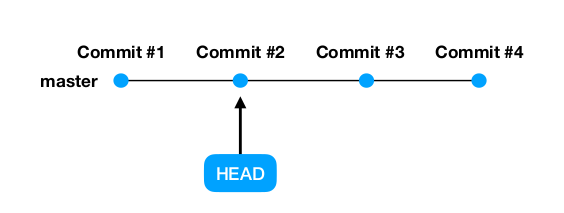

# git checkout

- Команда очень мощная и многофункциональная (как и git reset)
- Используется для перемещения между коммитами, версиями отдельных файлов и ветками

## Перемещение между коммитами

Хотим посмотреть, как выглядел проект в каком-то снимке в прошлом



```bash
git checkout <хэш commit #2>

git checkout HEAD^^

git checkout HEAD~2
```



- Состояние проекта полностью вернулось к указанному снимку. При этом
  никакие коммиты не удалились. Мы в любой момент можем перенестись
  обратно в актуальную версию.
- Указатель HEAD находится в состоянии DETACHED (рус. отделенный). Он
  отделен от актуальной версии проекта. Любые изменения или коммиты
  сделанные в этом состоянии удаляются сборщиком мусора при переходе к
  другому коммиту.

```bash
# Чтобы перейти обратно к актуальному коммиту, нужно выполнить комманду
# master - название текущей ветки.
git checkout master
```

## Перемещение между версиями файлов
Хотим вернуть конкретный файл(-ы) к какой-то версии в прошлом

---

```bash
git checkout <указатель коммита> -- путь_до_файла_1 путь_до_файла_2
# Пример: git checkout a0e33627548578d5b94c3b8f4f885303a2cd4eec -- file1 file2
```
Возвращает два файла file1 и file2 к версии, которая была у
них в указанном коммите
---

```bash
git checkout -- путь_до_файла_1 путь_до_файла_2
# Пример: git checkout -- file1
```

Возвращает file1 к версии, которая была у него в последнем
коммите (HEAD). Работает только для неотслеживаемых
(untracked или modified) изменений.

---

```bash
git checkout -- .
```

Возвращает все файлы в репозитории к версии, которая была у них в
последнем коммите (HEAD). Работает только для неотслеживаемых
(untracked или modified) изменений.

---

##### Что если я хочу удалить отслеживаемые изменения? (уже сделал git add)

```bash
git reset
# Переводит все отслеживаемые изменения в неотслеживаемые.

git checkout -- .
# удаляем все неотслеживаемые изменения
```

##### Зачем использовать две черты --?

Две черты указывают, что после них идет обычный текст

```bash
git checkout master 
# произведет переключение на ветку master.

git checkout --master 
# произведет возвращение файла с названием 
# master к версии из последнего коммита.
```