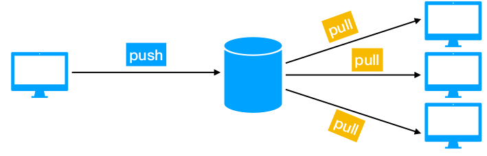

# Работа с удаленным репозиторием.

До сих пор вся наша работа была сохранена только локально на нашем компьютере

С помощью GIT можно отправить нашу работу на удаленный репозиторий



### Сервисы 

- GitHub 
- BitBucket 
- GitLab

## Комманда git remote

```bash
git remote -v 
# просмотр списка существующих удаленных репозиториев
# Пример git remote add origin https://github.com/AlexLeshchenko91/client
# На нашем компьютере будет хранится только ссылка на удаленный репозиторий origin - название этой ссылки
```

---

```bash
git remote add НАЗВАНИЕ_РЕПОЗИТОРИЯ АДРЕС_РЕПОЗИТОРИЯ
# добавить новый удаленный репозиторий, который находится по указанному адресу. 
# При этом, на нашем компьютере к удаленному репозиторию мы будем обращаться 
# по его названию
```

---
```bash
git remote remove НАЗВАНИЕ_РЕПОЗИТОРИЯ 
# удалить репозиторий с указанным названием
```

## Комманда git fetch [remote-name]
Данная команда связывается с указанным удалённым проектом и
забирает все те данные проекта, которых у вас еще нет.

## Комманда git push
Команда для отправки локального репозитория на удаленный
!!! GitHub скорее всего потребует от нас ввода пароля от нашего аккаунта.

```bash
git push НАЗВАНИЕ_УДАЛЕННОГО_РЕПОЗИТОРИЯ ВЕТКА
# Пример git push origin master
# Отправляем на удаленный репозиторий с именем origin нашу ветку master
```

## Комманда git pull
Команда для получения обновлений с удаленного репозитория
```bash
git pull origin master
# Теперь наш локальный репозиторий синхронизирован с удаленным
```
---

## Несколько удаленных репозиториев
Может быть несколько удаленных репозиториев

# SSH
- От английского - Secure SHell - "безопасная оболочка"
- SSH - сетевой протокол, позволяющий производить удалённое управление операционной системой
- SSH позволяет безопасно передавать данные в незащищённой среде

## НАСТРОЙКА SSH

### Проверка наличия существующих ключей SSH
https://docs.github.com/ru/authentication/connecting-to-github-with-ssh/checking-for-existing-ssh-keys

---

### Создание нового ключа SSH и его добавление в ssh-agent

https://docs.github.com/ru/authentication/connecting-to-github-with-ssh/generating-a-new-ssh-key-and-adding-it-to-the-ssh-agent

---

### Добавление нового ключа SSH в учетную запись GitHub

https://docs.github.com/ru/authentication/connecting-to-github-with-ssh/adding-a-new-ssh-key-to-your-github-account