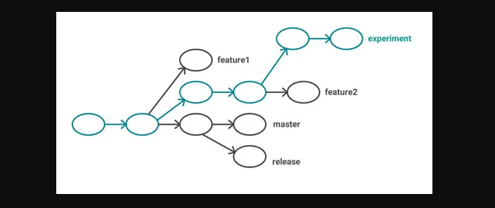
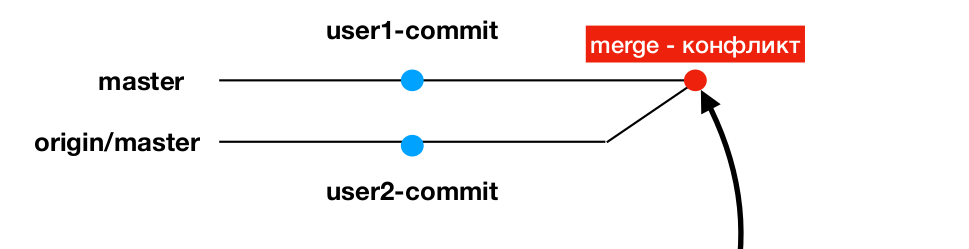
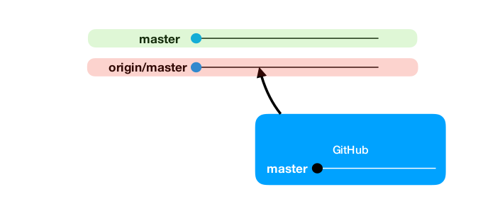

# Ветвление в Git

Почти каждая система контроля версий (СКВ) в какой-то форме
поддерживает ветвление. Используя ветвление, Вы отклоняетесь
от основной линии разработки и продолжаете работу независимо от
неё, не вмешиваясь в основную линию.

## Зачем использовать ветвление? 
- Новые функции разрабатываются в отдельных ветках
- Ветка master содержит стабильную версию проекта. Можем
вернуться на master в любой момент.
- Сразу несколько разработчиков могут работать в своих ветках
над своими задачами. После завершения работы над задачами,
эти ветки "сливаются" в master ветку.



## Команды 

### git branch название_ветки
Команда для создания новой ветки

```bash
git branch feature-one
# вызвали команду, находясь на Commit #3 
# новая ветка "отпочковывается" именно с этого коммита
```

### git branch
Команда для просмотра, на какой ветке мы сейчас находимся

### git branch -d название_ветки
Команда для удаления ветки

### git checkout название_ветки
Команда для переключение между ветками

```bash
git checkout feature-one
```

### git merge
Команда сливает одну ветку с другой

```bash
git checkout master
# переключились в ветку master

git merge feature-one
# Слили ветку feature-one в ветку master
```

#### Fast - Forward merge

- Пока мы работали в своей ветке, в ветке master ничего не
  произошло (не было новых коммитов)
- GIT'у очень легко слить ветку feature-one в master (не может
  возникнуть конфликтов)
- Не создается отдельный commit для слияния (merge commit)

#### ~~Fast - Forward merge~~
- Пока вы работали в своей ветке, кто-то добавил коммиты в ветку master
- Или вы сами добавили новые коммиты в ветку master (пример - вас попросили исправить какой-нибудь критический баг и запушить на GitHub)
- Могут возникнуть конфликты. Гит попробует решить их самостоятельно. Если у него не получится, придется решать их вручную.
- Merge commit создается.

#### Конфликты слияния

- Изменили один и тот же файл
- Конфликт 
- GIT не смог слить ветки 
- Необходимо решить конфликт вручную

Как решать конфликт? Нужно вручную отредактировать конфликтный файл

```php
<<<< HEAD #Где начинается конфликт

#Предыдущая версия кода

========== # Точка, где все выглядит сомнительным

#Что изменилось

>>>>> New Commit # Точка, где заканчивается конфликт
```

## Удалённые ветки

На удаленном репозитории может храниться не только ветка master, но и другие ветки

```bash
git branch -r
# Посмотреть ссылки на состояние веток в ваших удалённых репозиториях
```



Локальные ветки - изменяются только вами

Удаленные ветки - изменяются и другими людьми


### Зачем пушить свою ветку на удаленный репозиторий?
- Чтобы другие люди могли работать над вашей веткой
- Чтобы сделать резервную копию вашей локальной ветки

### Удаление удаленной ветки

```bash
git push --delete feature-one
```

## Комманда git pull и git fetch

```bash
git fetch

git pull origin master
```

- Команда git fetch "скачивает" удаленные ветки с репозитория, но не
производит актуализацию ваших локальных веток (не делает слияния
удаленной ветки с локальной)
- Команда git pull Скачивает удаленную ветку с удаленного репозитория (обновляет
  ветку origin/master) и сливает удаленную ветку с локальной веткой (производит
  актуализацию вашей локальной ветки)


