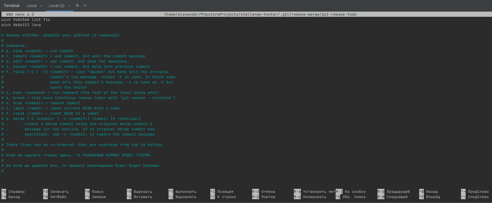
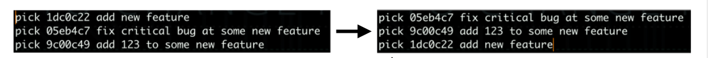
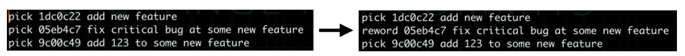
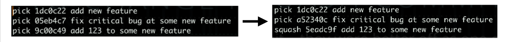
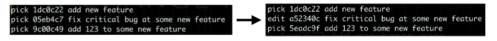

# Интерактивный rebase

- Обычный rebase нужен для манипуляций с ветками, интерактивный
rebase работает на одной ветке
- Обычный rebase берет коммиты из другой ветки, перемещает их в
нашу ветку и поверх этих коммитов по одному применяет коммиты
из временной зоны
- Интерактивный rebase не берет коммиты из другой ветки, он
помещает некоторые коммиты из текущей ветки во временную зону
и потом применяет эти коммиты опять к текущей ветке (в момент
применения мы можем изменить коммиты)
- Несмотря на то, что название команд одинаковое, обычный rebase
сильно отличается от интерактивного rebase (разная логика)

```bash
git rebase -i HEAD~3
# Хотим поменять три последних коммита
```



## Что можно делать с помощью интерактивного rebase?
- Поменять коммиты местами 
- Поменять название коммита / коммитов 
- Объединить два коммита в один 
- Добавить изменения в существующий коммит 
- ...