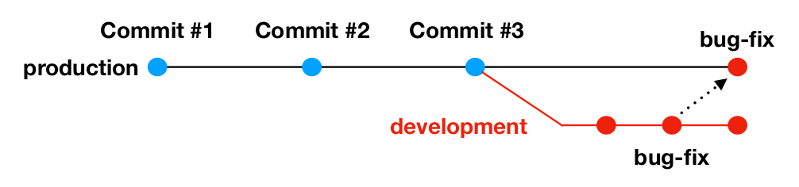

# git cherry-pick

Используется тогда, когда нам надо "взять" один или
несколько коммитов из другой ветки в нашу ветку



```bash

# Убеждаемся, что мы в правильной ветке
git checkout production

# Берем нужный нам коммит
git cherry-pick хэш_коммита
```

У взятого коммита будет другой хэш, отличный от хэша в оригинальной ветке (то есть формально это новый коммит)

#### Опции

```bash
# Хотим перенести коммит из другой ветки, но при этом хотим поменять сообщение коммита
git cherry-pick --edit


# Хотим перенести изменения из коммита из другой ветки, 
# но при этом не хотим делать коммит в нашей ветке. 
# Хотим, чтобы изменения просто попали в отслеживаемую зону.
git cherry-pick --no-commit

# Указывает в сообщении коммита хэш того коммита, из которого мы сделали cherry-pick
git cherry-pick -x хэш_коммита

# Указывает в сообщении коммита имя того пользователя, кто совершил cherry-pick
git cherry-pick --signoff хэш_коммита

```