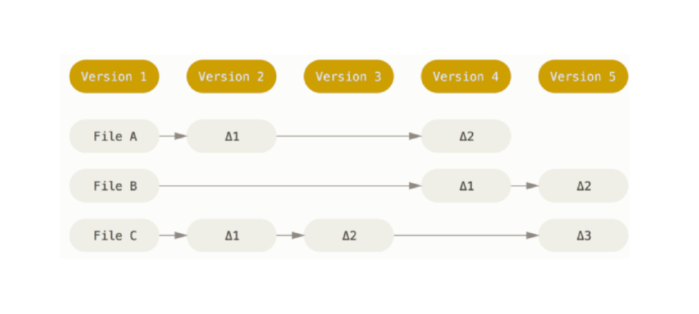
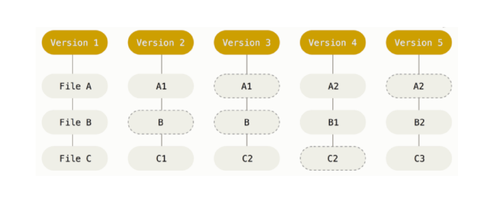

# Что такое GIT?

GIT - система контроля версий

Что такое «система контроля версий» и почему это важно?
Система контроля версий — это система, записывающая изменения
в файл или набор файлов в течение времени и позволяющая
вернуться позже к определённой версии.


### Как другие СКВ хранят изменения? 
В виде списка изменений в файлах

Снимки, а не различия

Основное отличие Git от любой другой СКВ (включая Subversion и
её собратьев) — это подход к работе со своими данными.
Концептуально, большинство других систем хранят информацию в
виде списка изменений в файлах. Эти системы (CVS, Subversion,
Perforce, Bazaar и т. д.) представляют хранимую информацию в
виде набора файлов и изменений, сделанных в каждом файле, по
времени (обычно это называют контролем версий, основанным на
различиях).



### Как GIT хранит изменения?

В виде снимков проекта во времени



# Конфигурация и Создание проекта

```bash
# помощь, документация
git help
# документация конкретной команды
git help название_команды 
```
---
```bash
# настройка конфига
git config --global user.name “Имя Фамилия”
git config --global user.email “Ваш email”
```

#### Создание проекта
```bash
mkdir название_проекта

cd название проекта

git init
```


