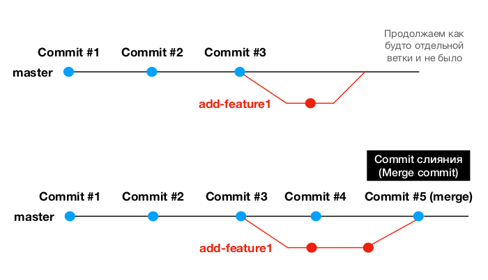
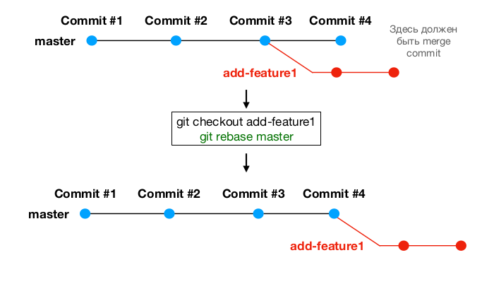
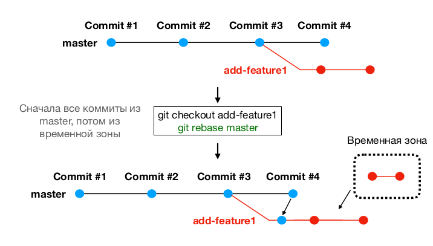
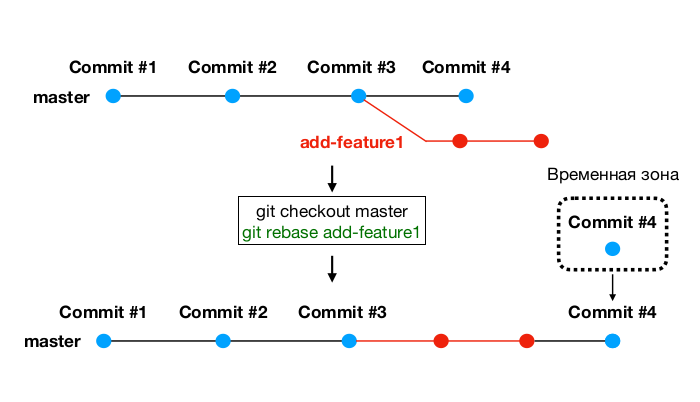
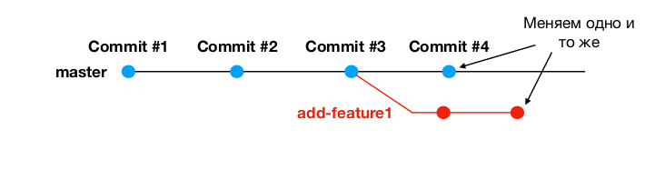

# Комманда rebase



rebase - альтернатива merge. Обе команды делают одно и то же - сливают ветки
- Команда merge может создавать merge commit при слиянии (в случае не
fast-forward), команда rebase merge commit'а не создает (дальше увидим
как это работает)
- Команда merge безопасней, чем rebase - есть отдельный commit,
отображающий слияние.
- Плюс merge - достоверная полная история commit'ов
- Плюс rebase - лаконичная линейная история без лишних коммитов
- Если в ветке долго велась работа и произошло много изменений лучше использовать merge
- Если ветка была недолгая и произошло мало изменений - можно использовать rebase
- Используйте merge, если вас не просят о rebase.

### Как работает rebase?


##### Временная зона


---

##### Наоборот




### Конфликты слияния при rebase


Разрешение конфликта такое же, как в случае с merge.

```bash
git rebase --continue
git rebase --abort
```
